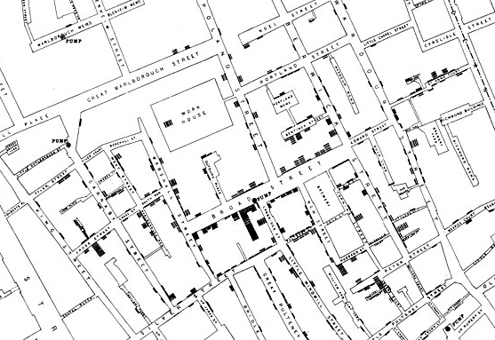
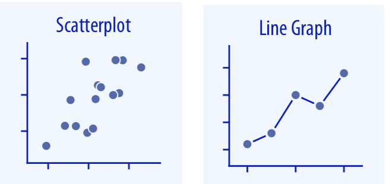
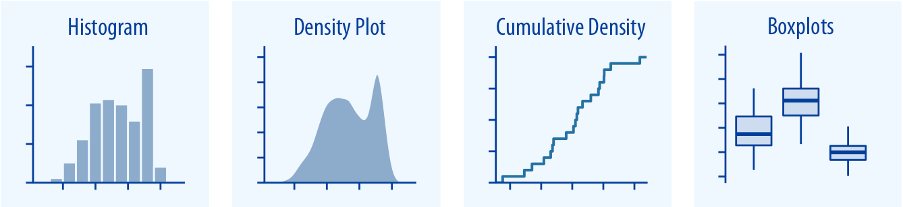
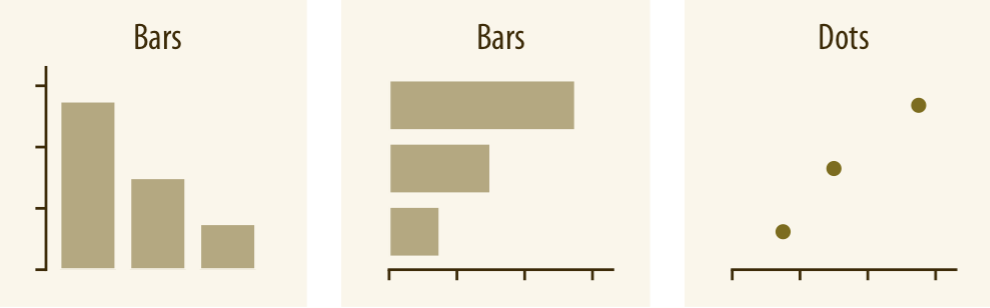
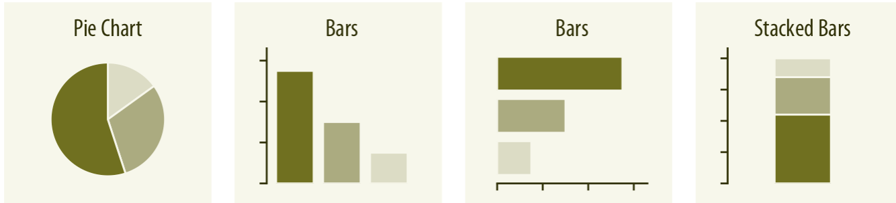

```{r setup, include=FALSE, cache=FALSE}
options(htmltools.dir.version = FALSE, width=80, continue="  ")
knitr::opts_chunk$set(warning = FALSE,
                      message = FALSE,
                      cache=TRUE,
                      comment = "",
                      prompt = FALSE,
                      include = FALSE,
                      echo = FALSE,
                      fig.path = "img/")

## from http://yihui.name/knitr/hooks#chunk_hooks
knitr::knit_hooks$set(small.mar=function(before, options, envir) {
                        if (before) par(mar=c(4, 5, 1, 1)) ## smaller margin on top and right
})
```

class: title-slide, middle, center

# Data visualization with R

## Robert Castelo
[robert.castelo@upf.edu](mailto:robert.castelo@upf.edu)
### Dept. of Medicine and Life Sciences
### Universitat Pompeu Fabra

<br>

## Fundamentals of Computational Biology
### BSc in Biomedical Sciences
### UPF School of Medicine and Life Sciences
### Academic Year 2025-2026

---

## Data visualization

* Data visualization is the transformation of data into a visual representation
  that **accurately** and **effectively** communicates information.  
  &nbsp;&nbsp;
* When it **accurately** reveals patterns, trends or outliers in the data
  that may not be apparent from raw values, it becomes a powerful tool for data
  analysis and exploration.  
  &nbsp;&nbsp;
* When it makes complex information more accessible and easier to understand,
  it becomes an **effective** way to communicate data insights to others.

---

## Data visualization

* [John Tukey (1915-2000)](https://en.wikipedia.org/wiki/John_Tukey), one of the
  most important contributors to the field of statistics and data analysis, who
  introduced the
  [box plot](https://en.wikipedia.org/wiki/Box_plot) and also coined computer
  science terminology such as [bit](https://en.wikipedia.org/wiki/Bit) or
  [software](https://en.wikipedia.org/wiki/Software), once said:
  > "The greatest value of a picture is when it forces us to notice what we never expected to see."  
  &nbsp;&nbsp;
* This quote highlights the power of data visualization to reveal insights and patterns
  that may not be immediately apparent from raw data, and emphasizes the importance
  of using visual representations to explore and understand complex datasets. See
  [John Tukey's obituary](https://doi.org/10.1063/1.1397408) for more information about
  his life and contributions to statistics and data analysis.

---

## Data visualization

.pull-left[
* [John Snow (1813-1858)](https://en.wikipedia.org/wiki/John_Snow) is considered
  one of the founders of epidemiology, and is best known for identifying the source
  of a [cholera](https://en.wikipedia.org/wiki/Cholera) outbreak in
  London in the mid-19th century.  
  &nbsp;&nbsp;
* He was born to a poor family in York, but already at a young age he
  showed an aptitude for mathematics and science, which led him to pursue
  a career in medicine, first in Newcastle and later in London.  
  &nbsp;&nbsp;
* As a young apprentice to a surgeon, Snow treated patients with cholera, which
  was a common and deadly disease in the 19th century.
]

.pull-right[

]

---

## Data visualization

* In 1854, a severe cholera outbreak occurred near Broad Street in London, killing
  over 600 people in just a few days. Snow tallied the number of deaths from
  cholera in the area and plotted them on a map, along with the locations of water
  pumps and was able to identify a cluster of cases around a
  particular water pump.



---

## Data visualization

* Snow's map provided strong evidence that the cholera outbreak was linked to
  contaminated water from the Broad Street pump, disproving the prevailing
  [miasma theory](https://en.wikipedia.org/wiki/Miasma_theory) of disease
  transmission at the time, and his work helped to establish the importance of
  clean water and sanitation in preventing the spread of disease.  
  &nbsp;&nbsp;
* Snow's use of data visualization to identify the source of the cholera
  outbreak is considered a landmark moment in the history of epidemiology and
  public health, and his map is often cited as an early example of the power of
  data visualization to reveal insights and inform public health interventions.  
  &nbsp;&nbsp;
* See
  [Paneth N. and Fine P., The singular science of John Snow, *The Lancet*, 2013](https://doi.org/10.1016/S0140-6736%2813%2960829-6),
  for more information about Snow's life and contributions to epidemiology and
  public health.  

---

## Basic types of visualization

* **Relationships**: Scatterplots, line plots, etc.

  
* **Distributions**: Histograms, density plots, box plots, etc.

  
* **Amounts**: Bar plots, stacked bars, dots, etc.

  
* **Proportions**: Bar plots, stacked bars, pie charts, etc.  

  

.footer[
Images from [Claus O. Wilke's book "Fundamentals of Data Visualization"](https://clauswilke.com/dataviz/)]
]

---

## Basic types of visualization in R

* We will use the `iris` dataset on the taxonomic characteristics of iris flowers used by
  [Fisher (1936)](https://onlinelibrary.wiley.com/doi/pdf/10.1111/j.1469-1809.1936.tb02137.x)
  to introduce certain statistical concepts. It contains measurements of the
  flowers of fifty plants for each of the three species _Iris setosa_,
  _Iris versicolor_ and _Iris virginica_.
<pre>                 
head(iris)          
      Sepal.Length Sepal.Width Petal.Length Petal.Width Species
1          5.1         3.5          1.4         0.2  setosa
2          4.9         3.0          1.4         0.2  setosa
3          4.7         3.2          1.3         0.2  setosa
4          4.6         3.1          1.5         0.2  setosa
5          5.0         3.6          1.4         0.2  setosa
6          5.4         3.9          1.7         0.4  setosa
levels(iris$Species)
[1] "setosa"     "versicolor" "virginica" 
</pre>


---

## Visualizing relationships in R

* The basic plotting function in R is `plot()`, which can be used to create a
  wide variety of plots, including scatterplots, line plots, and more.
```{r relationships-plot, echo=TRUE, out.width="60%", include=TRUE, dpi=100, fig.height=5}
plot(iris$Sepal.Length, iris$Sepal.Width, type="p", xlab="Sepal length", ylab="Sepal width", cex.lab=1.5)
```
* It is important to label the axes in plain language and large enough to be readable.

---

## Visualizing relationships in R

* Coloring the points by a categorical variable can help to reveal patterns in
  the data that may not be apparent when all points are the same color.  
```{r relationships2-plot, echo=TRUE, out.width="60%", include=TRUE, dpi=100, fig.height=5}
plot(iris$Sepal.Length, iris$Sepal.Width, type="p", xlab="Sepal length", ylab="Sepal width", cex.lab=1.5, pch=19, col=c("red", "blue", "green")[iris$Species])
legend("topright", legend=levels(iris$Species), col=c("red", "blue", "green"), pch=19, inset=0.01)
```

---

## Visualizing distributions in R

* A histogram is a graphical representation of the distribution of a continuous
  variable, where the data is divided into bins and the frequency of observations
  in each bin is represented by the height of a bar. Histograms can be produced in
  R using the `hist()` function.
```{r histogram-plot, echo=TRUE, include=TRUE, out.width="60%", dpi=100, fig.height=5}
hist(iris$Sepal.Length, xlab="Sepal length", ylab="Frequency", main="", col="lightblue", cex.lab=1.5)
```

---

## Visualizing distributions in R

* A [_box plot_](https://en.wikipedia.org/wiki/Box_plot)
  is used to plot the location, spread and skewness of a continuous (numerical)
  variable over different groups (factors). The R function `boxplot()` produces
  this specific plot, by providing a formula `y ~ grp`, where `y` is a numeric
  vector and `grp` is a grouping variable (usually a factor).
```{r boxplot-example, echo=TRUE, include=TRUE, out.width="60%", dpi=100, fig.height=5}
boxplot(iris$Sepal.Length ~ iris$Species, xlab = "Species", ylab = "Sepal length", cex.lab=1.5)
```


---

## Visualizing amounts in R

* A [_bar plot_, or bar chart,](https://en.wikipedia.org/wiki/Bar_chart)
  is used to represent a categorical variable such as a factor in the 
  x axis and a numeric value (e.g., an amount) in the y axis. The R
  function `barplot()` creates a bar plot with vertical or horizontal
  bars by just providing their height as a vector. The vector names will be
  used to plot the x axis labels.
```{r barplot-example, echo=TRUE, include=TRUE, out.width="60%", dpi=100, fig.height=5}
barplot(table(iris$Species), xlab="Species", ylab="Number of observations")
```

---

## Visualizing proportions in R

* A [_pie chart_](https://en.wikipedia.org/wiki/Pie_chart) is a circular statistical
  graphic, which is divided into slices to illustrate numerical proportion. The R
  function `pie()` creates a pie chart by providing the size of each slice as a
  vector. The vector names will be used to plot the labels.
```{r pie-chart-example, echo=TRUE, include=TRUE, out.width="50%", dpi=100, fig.height=5, small.mar=TRUE}
pie(table(iris$Species), col=c("red", "blue", "green"), cex=1.5)
```
* However, pie charts are not recommended for data visualization, as angles can be
  difficult to interpret and thus comparing the sizes of the slices accurately. Bar
  plots or other types of visualizations are often more effective for showing
  proportions.

---

## Combine plots using `par()`

* The function `par()` allows setting some specific graphical
  parameters. We can specify the number of subplots we need using the argument `mfrow = c(nr, nc)`,
  where `nr` and `nc` are the number of rows and columns of the subplot grid.
```{r combine-plots, echo=TRUE, include=TRUE, out.width="70%", dpi=100, fig.height=4, fig.width=8, small.mar=TRUE}
par(mfrow=c(1,2))
hist(iris$Sepal.Length, xlab="Sepal length", ylab="Frequency", main="", col="lightblue", cex.lab=1.5)
boxplot(iris$Sepal.Length ~ iris$Species, xlab = "Species", ylab = "Sepal length", cex.lab=1.5)
```

---

## Some basic guidelines for data visualization

* Use the appropriate type of plot for the data and the insight you want to communicate.  
  &nbsp;&nbsp;
* Label axes and legends clearly and use readable font sizes.  
  &nbsp;&nbsp;
* Use color effectively to highlight important information, but avoid using too
  many colors or using colors that are difficult to distinguish. About one every
  20 people have some form of color blindness, so you may want to consider using
  color palettes that are color-blind friendly.  
  &nbsp;&nbsp;
* Avoid cluttering the plot with unnecessary elements, such as gridlines or
  background colors, that can distract from the main message.  
  &nbsp;&nbsp;
* Avoid distorting the data by using inappropriate scales or axes. A plot with
  a lot of white space may indicate the use of an inappropriate scale.

---

## The Tidyverse

The [tidyverse](https://www.tidyverse.org/) is an opinionated collection of R 
packages designed for data science. All packages share an underlying design 
philosophy, grammar, and data structures.

```{r hex-ggplot2, out.width="10%", include=TRUE}
knitr::include_graphics("https://d33wubrfki0l68.cloudfront.net/2c6239d311be6d037c251c71c3902792f8c4ddd2/12f67/css/images/hex/ggplot2.png")
```

* _[ggplot2](https://ggplot2.tidyverse.org/)_. System for creating
  graphics, based on The Grammar of Graphics. You provide the data, tell ggplot2
  how to map variables to aesthetics and it takes care of the details. 
  
```{r, out.width="10%", include=TRUE}
knitr::include_graphics("https://d33wubrfki0l68.cloudfront.net/621a9c8c5d7b47c4b6d72e8f01f28d14310e8370/193fc/css/images/hex/dplyr.png")
```

* _[dplyr](https://dplyr.tidyverse.org/)_. Provides a grammar of data manipulation, 
  with a consistent set of verbs that solve the most common data manipulation 
  challenges. 

---

## The Tidyverse

The [tidyverse](https://www.tidyverse.org/) is an opinionated collection of R 
packages designed for data science. All packages share an underlying design 
philosophy, grammar, and data structures.


```{r, out.width="10%", include=TRUE}
knitr::include_graphics("https://d33wubrfki0l68.cloudfront.net/476fa4025501dcec05be08248b32d390dd2337d5/574c6/css/images/hex/tidyr.png")
```

* _[tidyr](https://tidyr.tidyverse.org/)_. Provides a set of functions that help 
  you get to tidy data. Tidy data is data with a consistent form: in brief, every 
  variable goes in a column, and every column is a variable. 


> Online book [R for Data Science](https://r4ds.had.co.nz) by [Hadley Wickham](http://hadley.nz).

`r emo::ji("warning")` __Important__: When searching on the internet or asking
an AI chatbot (e.g., ChatGPT or Gemini) for how to do something in R, you will
often find solutions based on tidyverse packages (ggplot, etc.). This can be
empowering if you understand what you are doing, but fustrating if you don't.
Adding *"in base R"* to your search query or prompt will often give you a
solution that does not require the tidyverse, which is what we are using in
this course.


---

## Concluding remarks

* Data visualization is a powerful tool for exploring and understanding data, and
  for communicating insights to others, when doing it accurately and effectively.  
  &nbsp;&nbsp;
* There are many different functions to produce plots in R. You should choose one
  depending on the insight you want to communicate and the type of data you have.  
  &nbsp;&nbsp;
* Additional graphical parameters can be modified by providing them as 
  arguments to the plotting functions.  
  &nbsp;&nbsp;
* You can combine plots side-by-side by using the function `par(nr, nc)`.  
  &nbsp;&nbsp;
* Attempt following basic visualization guidelines to make your plots more
  effective; see for instance
  [Claus O. Wilke's book "Fundamentals of Data Visualization"](https://clauswilke.com/dataviz/).

<!--

## Bonus track: R-Ladies (Barcelona)


* [R-Ladies](https://rladies.org) is a world-wide organization to promote gender
  diversity in the R community.
  * Supporting minority gender R enthusiasts achieve programming potential.
  * Building a collaborative global network of R leaders, mentors, learners and
    developers.
  * Encouraging, inspiring and empowering.
  * Creating safe space for everyone.
* [R-Ladies Barcelona](https://rladies.org/ladies-complete-list/locality/Barcelona)
  organizes
  [monthly meetups](https://www.meetup.com/rladies-barcelona),
  including R-related workshops, tutorials and talks.
* Twitter: [@RLadiesBCN](https://twitter.com/rladiesbcn)
* Meetup: [rladies-barcelona](https://www.meetup.com/rladies-barcelona)

-->
